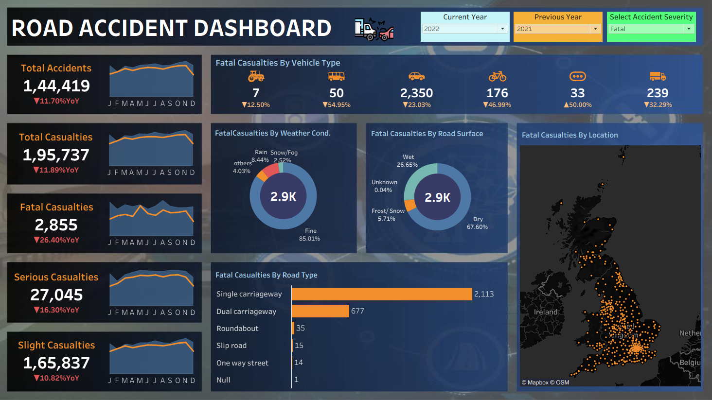

# Road-Accident-Dashboard-Tableau-Project
# 🚗 Road Accident Dashboard | Tableau

## 📌 Project Overview
An interactive Tableau dashboard built to analyze road accident trends, casualty severity, vehicle types, road conditions, weather conditions, and geographical accident distribution.

## 🎯 Objectives
- Monitor total accidents and casualties.
- Compare current year vs previous year performance.
- Analyze fatal casualties by vehicle type.
- Study the impact of weather and road surface conditions.
- Visualize accident hotspots using an interactive map.

## 🛠️ Tools & Technologies
- Tableau
- Excel / CSV
- Data Cleaning
- Data Visualization
- KPI Dashboard Design

## 📊 Key Insights
- Total Accidents: 144,419
- Total Casualties: 195,737
- Fatal Casualties: 2,855
- Most accidents occurred on Single Carriageways.
- Dry road conditions account for the majority of fatal casualties.
- Cars contribute the highest number of fatal casualties among vehicle types.

## 📷 Dashboard Preview

## 🚀 Features
- Dynamic Year Filter
- Accident Severity Filter
- KPI Cards with YoY Analysis
- Monthly Trend Sparklines
- Interactive Map
- Donut & Bar Chart Visualizations

## 👨‍💻 Author
**Vishnuvaran Reddy**
- LinkedIn: <your-linkedin-url>
- GitHub: <your-github-url>
